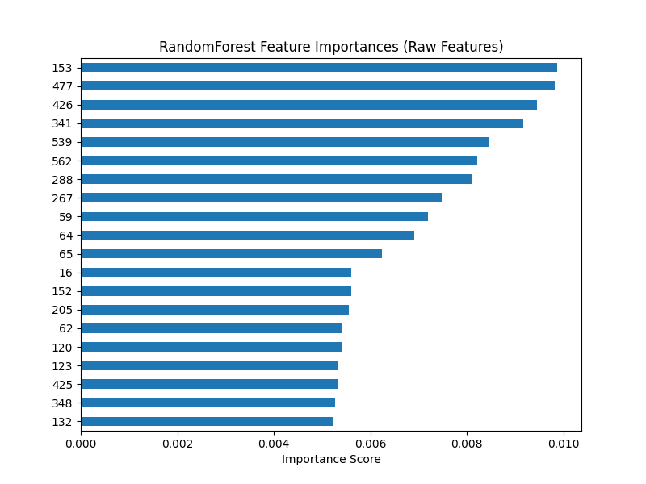

A robust end-to-end anomaly detection pipeline for manufacturing processes using the SECOM dataset, integrating supervised and unsupervised models to detect production faults efficiently.

**Production Line Anomaly Detection\*\*\*\*Production Line Anomaly Detection**

**Table of Contents**

* [Project Overview](#project-overview)
* [Dataset](#dataset)
* [Environment Setup](#environment-setup)
* [Installation](#installation)
* [Usage](#usage)

  * [Data Preparation](#data-preparation)
  * [Training & Evaluation](#training--evaluation)
  * [Inference](#inference)
* [Project Structure](#project-structure)
* [Feature Engineering](#feature-engineering)
* [Modeling & Tuning](#modeling--tuning)
* [Results](#results)
* [Feature Importances & Drift Monitoring](#feature-importances--drift-monitoring)
* [Future Improvements](#future-improvements)
* [License](#license)

---

## Project Overview

This repository implements an end-to-end **anomaly detection** pipeline for manufacturing processes using the **SECOM** dataset (Semiconductor Manufacturing Data). The goal is to identify faulty products in a production line by leveraging both supervised (RandomForest) and unsupervised (Isolation Forest, One-Class SVM, Autoencoder) methods.

Key components:

1. **Data preprocessing**: handling missing values and high-dimensional sensor data.
2. **Feature engineering**: lag features & rolling aggregates for temporal context.
3. **Dimensionality reduction**: StandardScaler + PCA to reduce noise and speed up training.
4. **Model training**: supervised vs unsupervised anomaly detectors.
5. **Hyperparameter tuning**: Successive Halving for RandomForest contamination and tree parameters.
6. **Evaluation**: ROC-AUC and Precision–Recall curves for performance comparison.
7. **Deployment**: saving/loading pipelines, inference function.
8. **Monitoring**: feature importances and Population Stability Index (PSI) to detect drift.

---

## Dataset

* **Source**: UCI SECOM dataset (Harvard Dataverse)

  * `secom.data`: 590 sensor variables per sample
  * `secom_labels.data`: labels (`-1` = faulty, `+1` = normal)
* **Link**: [https://dataverse.harvard.edu/dataset.xhtml?persistentId=doi:10.7910/DVN/6C3JR1](https://dataverse.harvard.edu/dataset.xhtml?persistentId=doi:10.7910/DVN/6C3JR1)

**Download & Arrange**:

```bash
mkdir data && cd data
wget https://dataverse.harvard.edu/api/access/datafile/####/secom.zip -O secom.zip
unzip secom.zip -d secom
```

---

## Environment Setup

Ensure you have Python 3.8+ installed. It’s recommended to create a virtual environment:

```bash
python3 -m venv venv
source venv/bin/activate  # on Windows: venv\Scripts\activate
```

## Installation

Install required packages:

```bash
pip install -r requirements.txt
```

*requirements.txt* should include:

```
pandas
numpy
scikit-learn
matplotlib
xgboost      # optional for supervised tuning
tensorflow   # optional for autoencoder
joblib
```

---

## Usage

### Data Preparation

```bash
python scripts/load_and_preprocess.py \
  --input_dir data/secom \
  --output_dir processed
```

This script:

1. Loads `secom.data` & `secom_labels.data`
2. Drops columns with >50% missing
3. Median-imputes remaining NaNs
4. Saves `processed/features.csv` and `processed/labels.csv`

### Training & Evaluation

```bash
python scripts/train_models.py \
  --data_dir processed \
  --output_dir models \
  --use_halving_search True
```

This trains:

* **IsolationForest** (unsupervised)
* **RandomForest** (supervised) with Successive Halving search
* Optionally **OneClass SVM** and **Autoencoder**

Generates performance metrics (ROC-AUC, AP) and plots in `models/`.

### Inference

```bash
python scripts/predict.py \
  --model_path models/rf_raw_model.joblib \
  --scaler_path models/scaler.joblib \
  --pca_path models/pca.joblib \
  --input new_batch.csv \
  --output predictions.csv
```

Calls `predict_fault()` to output `fault_flag` and probability for each sample.

---

## Project Structure

```
├── data/                 # raw & unzipped SECOM data
├── processed/            # preprocessed features & labels
├── models/               # trained model artifacts (joblib files)
├── scripts/              # Python scripts for each stage
│   ├── load_and_preprocess.py
│   ├── train_models.py
│   └── predict.py
├── notebooks/            # Jupyter notebooks for exploration
├── requirements.txt      # pip dependencies
└── README.md             # this file
```

---

## Feature Engineering

* **Lag Features**: 1-step lag (`X.shift(1)`) to capture temporal patterns.
* **Rolling Means**: 5-step window rolling averages (`X.rolling(5).mean()`).
* Concatenate original, lag, and rolling into a combined DataFrame.

---

## Modeling & Tuning

1. **Scaling + PCA**: reduce to 95% explained variance.
2. **IsolationForest**: trained on normal data, `contamination` clamped ≤0.5.
3. **RandomForest**: tuned with `HalvingGridSearchCV` to find best `max_depth`, `min_samples_split`, and `n_estimators` via resource-efficient successive halving.
4. **OneClassSVM** & **Autoencoder**: unsupervised baselines for comparison.

---

## Results

| Model                | ROC AUC | Avg Precision |
| -------------------- | ------- | ------------- |
| IsolationForest      | 0.57    | 0.94          |
| RandomForest (tuned) | 0.61    | 0.955         |
| One-Class SVM        | N/A     | 0.923         |
| Autoencoder          | N/A     | 0.919         |


**Conclusion**: Supervised RandomForest provides the best fault detection. High AP (>0.95) ensures few false alarms.

---

## Feature Importances & Drift Monitoring



* Retrained `rf_raw` on scaled raw features to extract importances.
* Top features listed in `models/feature_importances.csv`.
* **PSI** (Population Stability Index) computed between train & test distributions; features with PSI >0.10 flagged for drift and monitoring.

| Feature Index |    PSI | Drift Level | What to Do                                                    |
| ------------: | -----: | :---------: | :------------------------------------------------------------ |
|           426 | 0.1239 |   Moderate  | Investigate sensor/process behind column 426.                 |
|           153 | 0.1054 |   Moderate  | Look for operational changes or noise issues in this channel. |
|           135 | 0.1001 |   Moderate  | Right on the “watch” threshold—monitor going forward.         |
|           405 | 0.0990 |    Slight   | Just under moderate—keep an eye on it.                        |
|           288 | 0.0989 |    Slight   | Same as above.                                                |
|           456 | 0.0928 |    Slight   | Slight drift—probably OK but note any process tweaks.         |
|           367 | 0.0870 |    Slight   | Slight drift.                                                 |
|           138 | 0.0867 |    Slight   | Slight drift.                                                 |
|            88 | 0.0821 |    Slight   | Slight drift.                                                 |
|           411 | 0.0820 |    Slight   | Slight drift.                                                 |


---

## Future Improvements

* Integrate a **real-time** streaming architecture (e.g., Kafka) for continuous monitoring.
* Add **domain-specific** features (e.g., ratios, exponentially weighted averages).
* Extend **model ensemble**: blend supervised and unsupervised scores.
* Implement **automated alerts** and **retraining triggers** in production.

---
